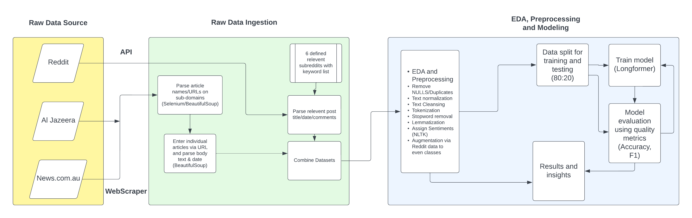

# Sentiment Analysis of Media Portrayals of the Israel-Palestine Conflict

## Overview

This project conducts a detailed sentiment analysis of media portrayals regarding the Israel-Palestine conflict. It utilizes advanced Natural Language Processing (NLP) techniques to analyze data from various media sources, including News.com.au, Al Jazeera, and Reddit. The core objective is to uncover the underlying sentiments in the media narratives and public discussions surrounding this complex geopolitical issue.

Note for assessors: Code is stored in 2 Jupyter Notebook files. The accompanying WORD doc is submitted on the online portal.
- **A3_WebScraper_JakeLasslett.ipynb**: This caputes the 3 seperate scrapers/API used to gather teh relevent data.
- **A3_Part2_EDA_PreProcessing_Modelling_JakeLasslett.ipynb**: This captures the remaining analysis
Note: I have not added the model/result tensorflow/pt files as they are too large (+6GB). Adequate model performance can be observed in the Part 2 notebook.

## Key Objectives
- **Comparative Analysis**: Evaluate how different media outlets represent the Israel-Palestine conflict.
- **Sentiment Classification**: Classify texts into sentiment categories (positive, negative, neutral) using NLP models.
- **Bias Identification**: Identify potential biases in media coverage through sentiment distribution analysis.

## Tech Stack & Modules
This project utilizes a robust tech stack and various modules, key among them being:
- **Python**: Primary programming language for data wrangling and analysis.
- **Longformer**: Transformer model used for processing long sequences in sentiment analysis.
- **NLTK**: Natural Language Toolkit for text preprocessing and sentiment analysis.
- **Pandas & NumPy**: Data manipulation and numerical computation.
- **Matplotlib & Seaborn**: Data visualization and graphical plotting.
- **Scikit-learn**: Machine learning library for model evaluation and metrics.
- **Jupyter Notebooks**: Interactive computational environment for running and documenting code.
- **Beautiful Soup & Requests**: Web scraping tools for data collection.
- **PRAW**: Python Reddit API Wrapper used for scraping Reddit data.
- **Selenium**: Tool for automating web browser interaction, used in web scraping.

## Data Sources
- **News Articles**: Extracted from News.com.au and Al Jazeera.
- **Reddit Discussions**: Related to the Israel-Palestine conflict.
- **Data Wrangling**: Includes data cleaning, normalization, and tokenization to prepare for analysis.

## Methodology
- **Data Wrangling**: Standardizing, cleaning, and preprocessing text data for NLP analysis.
- **NLP Model**: Utilizing the Longformer transformer model for effective handling of long text sequences.
- **Visualization**: Utilizing graphs and charts to illustrate the sentiment distribution and trends.

## Repository Download and Setup

To use this project, you need to download the repository from GitHub and set up the required environment.

### Downloading the Repository

1. Navigate to the GitHub page of the project.
2. Click on the 'Code' button and copy the URL for cloning.
3. Open your command line interface (CLI).
4. Navigate to the directory where you want to clone the repository.
5. Use the command `git clone [URL]`, replacing `[URL]` with the copied URL`https://github.com/jake-lasslett/A3_NLPSentimentAnalysis_JakeLasslett.git`.
6. Once cloned, navigate into the project directory.

### Setting Up the Environment

Ensure you have Python installed on your system. This project requires Python 3.6 or later.

1. Open the CLI and navigate to the project directory.
2. Create a virtual environment for the project:

`python -m venv venv`
3. Activate the virtual environment:
- On Windows: `venv\Scripts\activate`
- On MacOS/Linux: `source venv/bin/activate`
4. Install the required modules:

`pip install -r requirements.txt`

## Usage

After setting up the environment, you can run the scripts provided in the repository to perform sentiment analysis. Make sure to follow any specific instructions or comments within the scripts to understand the flow and functionality.

## Conclusion

This project aims to shed light on the sentiment dynamics in media coverage of the Israel-Palestine conflict. Through the use of sophisticated machine learning models and NLP techniques, it provides a nuanced understanding of the diverse perspectives presented in different media outlets.

